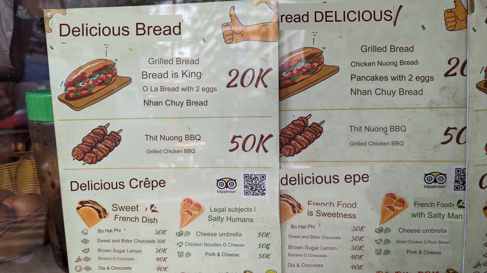

# TranslateWithContext
Image to image translation utilising LLMs.

## Overview

Image to imagetranslation services like those provided by google lens and google translate promise a seemless translating experience of the real world around you. However the provided translation are often only partially correct or do not make senase in the context of the texts surrounding. 

The intention of this project is to extract context from the source image, such as if its an image of a menu or a street sign, and use this information to supplement the neural translation model to improve translations in context. LLMs have a mastery over context unlike previous language modelling techniques which may allow us to improve the usability of image to image translation applications or at the very least improve user experience by providing more upfront data.

